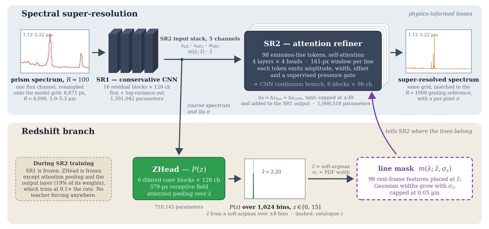

# specsr

**Physics-informed deep learning for super-resolving galaxy spectra.**

`specsr` enhances low-resolution galaxy spectra by a factor of ~10 in resolving
power (R~100 → R~1000), recovering narrow emission-line features — including
blended doublets such as [O III] λλ4959,5007 and Hβ — that are entirely
unresolvable at prism resolution.

The model is trained on paired JWST/NIRSpec observations from JADES, where each
galaxy contributes a low-resolution prism spectrum and a stitched
medium-resolution grating reference.

```{admonition} Reference
:class: seealso

Haghjoo, A., Hemmati, S., Mobasher, B., et al.
*Learning to See Sharper: A Physics-Informed Artificial Intelligence Framework
for Super-Resolving Galaxy Spectra.*
[arXiv:2603.18357](https://arxiv.org/abs/2603.18357)
```

## Quickstart

```python
from specsr.inference import SpecSRPipeline

pipeline = SpecSRPipeline.from_pretrained()      # weights fetched from the Hub
result = pipeline(flux_low, wavelength_low)      # your own wavelength grid

result.sr1         # super-resolved spectrum
result.sr2         # after physics-informed line refinement
result.sr2_sigma   # wavelength-dependent predictive uncertainty
result.z           # inferred redshift, with result.z_sigma
result.wavelength  # the HR grid, in microns
```

Pass `wavelength_low` unless your spectrum is already on `pipeline.wavelength`:
the input is then resampled onto the model's grid by integration rather than
interpolation, so line flux is preserved by construction.

```{admonition} The model does not predict absolute flux scale
:class: warning

Training standardises each spectrum independently, so what the model learns is a
mapping from *shape* to *shape*. Output is returned on the **input's** scale,
which is not the true high-resolution spectrum's scale — a median factor of ~4
apart on validation data, and past 40 on individual objects.

The returned arrays are self-consistent within one spectrum. Comparing them
against a real grating spectrum, or across objects, requires standardising both
sides first — which is why every figure in the paper is labelled
$F_\lambda$ *(normalized)*.
```

New here? The [tutorials](guides/tutorials) are three executable notebooks with
real spectra bundled, and they run with no survey data.

## How it works



Three stages, trained in sequence, each freezing the one before it: **SR1**, a
1D residual CNN backbone that maps the prism spectrum to a grating-like
reconstruction with a per-pixel variance; **ZHead**, which infers a redshift
from SR1's output as a distribution over 1,024 bins; and **SR2**, which refines
the result with attention over 98 emission-line tokens placed at the predicted
redshift, plus a CNN continuum branch.

Every number on the diagram is read off the released checkpoints at draw time,
and its inset panels are real predictions for a held-out galaxy.

```{toctree}
:maxdepth: 2
:caption: Guides

guides/installation
guides/tutorials
guides/data
guides/training
guides/evaluation
```

```{toctree}
:maxdepth: 2
:caption: Reference

api/index
changelog
```

## Indices

* {ref}`genindex`
* {ref}`modindex`
